<p align="center">
  
  
  
  
  
  
  
  
</p>

# 🔊 Echo

### A Production-Grade, Event-Driven Messaging Platform

> **Echo** is a Slack-inspired real-time messaging platform built with microservices architecture, demonstrating enterprise-grade patterns for scalability, observability, and operational excellence.

<p align="center">
  <a href="http://52.60.212.149"><strong>🌐 Live Demo</strong></a>
</p>

> **Try it live** — The demo is deployed on AWS EC2 via the CI/CD pipeline. Create an account, set up a workspace, invite others, and experience real-time messaging.

**Demo Credentials** (or create your own account):

- **User 1**: `user1` / `Password1`
- **User 2**: `user2` / `Password2`

---

## 📋 Table of Contents

- [Architecture Overview](#-architecture-overview)
- [System Design](#-system-design)
- [Tech Stack & Rationale](#-tech-stack--rationale)
- [Design Decisions & Trade-offs](#-design-decisions--trade-offs)
- [Security Architecture](#-security-architecture)
- [Observability Stack](#-observability-stack)
- [Testing Strategy](#-testing-strategy)
- [Infrastructure as Code](#-infrastructure-as-code)
- [CI/CD Pipeline](#-cicd-pipeline)
- [Getting Started](#-getting-started)
- [Project Structure](#-project-structure)
- [API Documentation](#-api-documentation)
- [Future Roadmap](#-future-roadmap)

---

## 🏗 Architecture Overview

Echo follows a **microservices architecture** with **event-driven communication**, designed for horizontal scalability and fault tolerance.

### High-Level Architecture

```mermaid
flowchart LR
    subgraph Clients["👤 Clients"]
        WEB["Web App<br/>(Next.js 16)"]
    end

    subgraph BFF["🔀 BFF Layer"]
        BFFS["BFF Service :8004<br/>REST + WebSocket"]
    end

    subgraph Services["⚙️ Core Services"]
        direction TB
        US["User Service :8001"]
        WCS["Workspace-Channel Service :8002"]
        MS["Message Service :8003"]
        NS["Notification Service :8005"]
    end

    subgraph Infra["🗄️ Infrastructure"]
        PG[("PostgreSQL<br/>(per-service DBs)")] ~~~ REDIS[("Redis<br/>Cache")] ~~~ RMQ[["RabbitMQ<br/>Event Bus"]]
    end

    subgraph O11y["📊 Observability"]
        GRAFANA["Grafana Stack<br/>Metrics • Logs • Traces"]
    end

    %% Request flow
    WEB --> BFFS
    BFFS --> US & WCS & MS

    %% Infrastructure connections
    US & WCS & MS --> PG
    US & WCS & MS & BFFS --> REDIS

    %% Async event bus
    US & WCS & MS -.->|"Publish"| RMQ
    RMQ -.->|"Subscribe"| NS & BFFS

    %% Observability
    US & WCS & MS & NS & BFFS -.-> GRAFANA
```



> **Legend**: Solid lines = synchronous (HTTP), Dashed lines = asynchronous (events/telemetry)

### Service Communication Patterns

| Pattern                     | Use Case                    | Implementation                             |
| --------------------------- | --------------------------- | ------------------------------------------ |
| **Synchronous (HTTP)**      | Request-response operations | BFF orchestrates calls to backend services |
| **Asynchronous (RabbitMQ)** | Event-driven workflows      | Topic exchange with routing keys           |
| **Real-time (WebSocket)**   | Live updates to clients     | Socket.IO with Redis adapter for scaling   |

---

## 🎯 System Design

### Service Responsibilities

| Service                       | Responsibility                       | Database                | Key Features                                                      |
| ----------------------------- | ------------------------------------ | ----------------------- | ----------------------------------------------------------------- |
| **BFF Service**               | API orchestration, WebSocket gateway | —                       | Request aggregation, real-time event broadcasting, JWT validation |
| **User Service**              | Authentication, user profiles        | `users_db`              | JWT tokens, password reset, session management                    |
| **Workspace-Channel Service** | Workspaces, channels, memberships    | `workspace_channels_db` | Create/manage workspace/channel, invite system, role-based access |
| **Message Service**           | Messages handling                    | `message_db`            | Threaded conversations, read receipts, message ordering           |
| **Notification Service**      | Email notifications                  | —                       | Template rendering, SMTP (Gmail/MailHog)                          |

### Event Flow Example: Real-time Messaging


---

## 🛠 Tech Stack & Rationale

### Backend

| Technology       | Choice         | Rationale                                                              |
| ---------------- | -------------- | ---------------------------------------------------------------------- |
| **Runtime**      | Node.js 22     | Non-blocking I/O ideal for real-time messaging; large ecosystem        |
| **Language**     | TypeScript 5.3 | Type safety, better maintainability, excellent IDE support             |
| **Framework**    | Express.js     | Mature, flexible, extensive middleware ecosystem                       |
| **ORM**          | Prisma         | Type-safe database access, excellent migrations, auto-generated client |
| **DI Container** | tsyringe       | Lightweight dependency injection for testable, decoupled services      |

### Frontend

| Technology        | Choice           | Rationale                                          |
| ----------------- | ---------------- | -------------------------------------------------- |
| **Framework**     | Next.js 16       | Server components, app router, optimized builds    |
| **UI Library**    | React 19         | Latest concurrent features, improved performance   |
| **State**         | Zustand          | Lightweight, TypeScript-first, no boilerplate      |
| **Data Fetching** | TanStack Query   | Caching, background refetching, optimistic updates |
| **Real-time**     | Socket.IO Client | Robust WebSocket with automatic reconnection       |
| **Styling**       | Tailwind CSS 4   | Utility-first, consistent design system            |
| **Observability** | Grafana Faro     | Frontend RUM, error tracking, distributed tracing  |

### Infrastructure

| Technology            | Choice        | Rationale                                                  |
| --------------------- | ------------- | ---------------------------------------------------------- |
| **Database**          | PostgreSQL 16 | ACID compliance, JSON support, proven reliability at scale |
| **Cache**             | Redis 7       | Sub-millisecond latency, pub/sub for Socket.IO adapter     |
| **Message Broker**    | RabbitMQ 4    | Reliable delivery, topic exchanges, management UI          |
| **Container Runtime** | Docker        | Consistent environments, easy local development            |
| **Orchestration**     | Kubernetes    | Production-grade scaling, self-healing, declarative config |

### Why These Choices?

1. **PostgreSQL over NoSQL**: Messaging requires strong consistency, complex queries (threads, mentions), and ACID transactions. Each service owns its database following the database-per-service pattern.

2. **RabbitMQ over Kafka**: For this scale, RabbitMQ provides simpler operations, better routing flexibility with topic exchanges, and sufficient throughput. Kafka would be overkill without stream processing needs.

3. **BFF Pattern over API Gateway**: A dedicated BFF service allows request aggregation, protocol translation (HTTP→WebSocket), and frontend-specific optimizations without bloating individual services.

4. **Socket.IO with Redis Adapter**: Enables horizontal scaling of WebSocket connections. Any BFF instance can broadcast to clients connected to other instances.

---

## ⚖️ Design Decisions & Trade-offs

### 1. Database-per-Service Pattern

```
✅ Advantages                          ❌ Trade-offs
───────────────────────────────────    ───────────────────────────────────
• Service autonomy & independence      • No cross-service JOINs
• Independent scaling                  • Distributed transaction complexity
• Technology flexibility               • Data duplication for queries
• Fault isolation
```

**Mitigation**: Services communicate via well-defined APIs. The BFF aggregates data from multiple services when needed.

### 2. Event-Driven Architecture with Outbox Pattern

Workspace-Channel Service uses transactional outbox

1. Write business data + event to same transaction
2. Background publisher reads outbox and publishes to RabbitMQ
3. Guarantees at-least-once delivery even if RabbitMQ is down

**Why Outbox?** Prevents message loss during service crashes between database commit and event publish.

### 3. Synchronous Service-to-Service Calls

**Decision**: Services call each other via HTTP for real-time data needs.

```
✅ Simplicity                          ❌ Trade-offs
───────────────────────────────────    ───────────────────────────────────
• Easier debugging & tracing           • Cascading failures possible
• Immediate consistency                • Increased latency
• Simpler error handling               • Tighter coupling
```

**Mitigation**:

- ✅ Retry with exponential backoff via shared `@echo/http-client` package
- ✅ Redis caching for frequently accessed data (e.g., channel membership)
- ⏳ Circuit breaker patterns (planned)

### 4. Composite Primary Keys & Atomic Message Ordering

```prisma
model Message {
  workspaceId String @map("workspace_id")
  channelId   String @map("channel_id")
  messageNo   BigInt @map("message_no")

  @@id([workspaceId, channelId, messageNo])
}
```

**Why?** Enables efficient pagination by `messageNo` within a channel, natural partitioning key for future sharding, and guaranteed message ordering.

**Concurrency Handling**: Message numbers are generated atomically using a PostgreSQL function with `INSERT ... ON CONFLICT DO UPDATE` pattern. This prevents race conditions when multiple users send messages simultaneously—each message gets a unique, sequential number within its channel, even under concurrent load. Integration tests verify this behavior with parallel message creation.

### 5. WebSocket Connection Management

**Challenge**: WebSockets are stateful, but microservices should be stateless. How do you handle graceful shutdown without dropping active connections?

**Solution**:

1. **Redis Adapter**: Socket.IO uses Redis pub/sub, allowing any BFF instance to broadcast to clients connected to other instances
2. **Graceful Shutdown**: On SIGTERM/SIGINT, the BFF stops accepting new connections, closes Socket.IO gracefully, then terminates Redis/RabbitMQ connections (10-second drain period)
3. **Client Resilience**: Socket.IO clients have built-in reconnection with exponential backoff, seamlessly failing over to other BFF instances

### 6. Dead Letter Queue with Waiting Room Pattern

**Challenge**: What happens when event processing fails? How do you prevent message loss while avoiding infinite retry loops?

**Solution**: Three-tier queue architecture for critical events:

```
Main Queue → (on failure) → Waiting Room → (after 30s TTL) → Main Queue
                                    ↓
                         (after 3 retries) → Parking Lot
```

- **Waiting Room**: Failed messages wait 30 seconds before retry (prevents thundering herd)
- **Parking Lot**: After 3 retries, messages are parked for manual inspection with failure metadata
- **Non-Critical Events**: Some Real-time events use ephemeral queues—acceptable to miss during reconnection

### 7. Centralized Shared Libraries

```
services/shared/
├── logger/      # Winston-based structured logging
├── telemetry/   # OpenTelemetry tracing + context propagation
├── metrics/     # Prometheus metrics + Express middleware
└── http-client/ # Axios wrapper with tracing headers
```

**Decision**: Extract cross-cutting concerns into shared packages.

**Trade-off**: Creates coupling but ensures consistent observability across all services.

---

## 🔒 Security Architecture

Security is built into the design.

### Defense in Depth

| Layer                       | Implementation                          | Details                                                |
| --------------------------- | --------------------------------------- | ------------------------------------------------------ |
| **Rate Limiting (Edge)**    | Nginx                                   | `10 req/s` per IP with burst of 20                     |
| **Rate Limiting (App)**     | express-rate-limit                      | `100 req/15min` per IP                                 |
| **Rate Limiting (Feature)** | Per-email tracking                      | Password reset: max requests per time window           |
| **Security Headers**        | Helmet.js                               | XSS protection, content-type sniffing prevention, etc. |
| **CORS**                    | Whitelist origin                        | Credentials enabled, specific headers allowed          |
| **Authentication**          | JWT                                     | Access + refresh token pattern                         |
| **Secrets Management**      | K8s Secrets / Env vars / GitHub Secrets | Never hardcoded, injected at runtime                   |

### Input Validation & Sanitization

- Request validation with Zod schemas at API boundaries
- Parameterized queries via Prisma (SQL injection prevention)
- JWT secret length validation in production (minimum 32 characters)
- Production startup fails if default/weak secrets detected

### Future Security Enhancements

- OWASP ZAP vulnerability scanning
- Dependency scanning (Snyk/Dependabot)
- Penetration testing

---

## 📊 Observability Stack

Echo implements the **three pillars of observability**: Logs, Metrics, and Traces.

### Architecture


### Components

| Component                   | Purpose                               | Configuration                                                                |
| --------------------------- | ------------------------------------- | ---------------------------------------------------------------------------- |
| **OpenTelemetry Collector** | Receives traces from services         | [otel-collector-config.yaml](O11y/otel-collector/otel-collector-config.yaml) |
| **Grafana Tempo**           | Distributed tracing backend           | [tempo-config.yaml](O11y/tempo/tempo-config.yaml)                            |
| **Grafana Loki**            | Log aggregation (7-day retention)     | [loki-config.yaml](O11y/loki/loki-config.yaml)                               |
| **Prometheus**              | Metrics scraping & storage            | [prometheus.yml](O11y/prometheus/prometheus.yml)                             |
| **Grafana Alloy**           | Docker log collection + Faro receiver | [config.alloy](O11y/alloy/config.alloy)                                      |
| **Grafana**                 | Unified dashboards                    | [provisioning/](O11y/grafana/provisioning/)                                  |

### Pre-built Dashboards

- **Service Overview**: Request rate, error rate, latency (RED metrics)
- **Business Metrics**: Messages sent, active users, workspace activity
- **Infrastructure**: PostgreSQL, Redis, RabbitMQ health
- **Frontend**: Core Web Vitals, JavaScript errors, user sessions

### Distributed Tracing

Traces flow through the entire request lifecycle:

```
Client Request → BFF → User Service → Database
                    ↘ Message Service → RabbitMQ
                                      ↘ Notification Service → SMTP
```

**Correlation**: Logs include `trace_id` for seamless log-to-trace navigation in Grafana.

---

## 🧪 Testing Strategy

### Testing Pyramid

```
                    ┌───────────┐
                    │   E2E     │  ← Full workflow tests
                    │  Tests    │    (system-tests/api-e2e)
                    └─────┬─────┘
                    ┌─────┴─────┐
                    │Integration│  ← Database + external services
                    │   Tests   │    (*.integration.test.ts)
                    └─────┬─────┘
              ┌───────────┴───────────┐
              │      Unit Tests       │  ← Business logic isolation
              │  (*.unit.test.ts)     │    (Jest + mocks)
              └───────────────────────┘
```

### Test Types

| Type                  | Scope                    | Tools                      | Location                        |
| --------------------- | ------------------------ | -------------------------- | ------------------------------- |
| **Unit Tests**        | Service/repository logic | Jest, mocks                | `services/*/tests/unit/`        |
| **Integration Tests** | Database operations      | Jest, real PostgreSQL      | `services/*/tests/integration/` |
| **E2E API Tests**     | Full service workflows   | Jest, Supertest, Socket.IO | `system-tests/api-e2e/`         |

### Running Tests

```bash
# Unit tests (fast, isolated)
npm run test:unit --workspace=services/user-service

# Integration tests (requires PostgreSQL)
npm run test:integration --workspace=services/message-service

# All tests for a service
npm run test --workspace=services/workspace-channel-service

# E2E tests (requires all services running)
cd system-tests/api-e2e && npm test
```

### E2E Test Coverage

The E2E suite validates critical user journeys:

1. **Message Workflow** ([message-workflow.test.ts](system-tests/api-e2e/tests/message-workflow.test.ts))
   - User signup → Login → Create workspace → Create channel → Send message → Receive via WebSocket

2. **Invite Workflow** ([invite-workflow.test.ts](system-tests/api-e2e/tests/invite-workflow.test.ts))
   - Create invite → Send email notification → Accept invite → Verify membership

---

## 🏗 Infrastructure as Code

### Kubernetes Manifests

Echo includes production-ready Kubernetes configurations using Kustomize:

```
k8s/
├── base/                    # Shared configurations
│   ├── namespace.yaml       # echo namespace
│   ├── kustomization.yaml   # Base resources
│   ├── configmaps/          # Environment configs
│   ├── deployments/         # Service deployments
│   │   ├── user-service.yaml
│   │   ├── message-service.yaml
│   │   ├── workspace-channel-service.yaml
│   │   ├── notification-service.yaml
│   │   ├── bff-service.yaml
│   │   └── frontend.yaml
│   ├── services/            # ClusterIP services
│   └── observability/       # Monitoring stack
├── local/                   # Minikube overrides
└── production/              # Production overrides (secrets, replicas)
```

### Deployment Features

- **Resource Limits**: CPU/memory requests and limits defined
- **Health Checks**: Liveness and readiness probes
- **ConfigMaps**: Environment-specific configuration
- **Secrets**: Sensitive data management
- **Service Discovery**: Internal DNS resolution

### Resource Quotas

Each service has defined resource requests and limits to prevent noisy neighbor syndrome and enable cluster autoscaling:

| Service              | CPU Request | CPU Limit | Memory Request | Memory Limit |
| -------------------- | ----------- | --------- | -------------- | ------------ |
| Message Service      | 100m        | 500m      | 128Mi          | 512Mi        |
| User Service         | 100m        | 500m      | 128Mi          | 512Mi        |
| BFF Service          | 100m        | 500m      | 128Mi          | 512Mi        |
| Workspace-Channel    | 100m        | 500m      | 128Mi          | 512Mi        |
| Notification Service | 100m        | 500m      | 128Mi          | 512Mi        |
| Frontend             | 100m        | 500m      | 128Mi          | 512Mi        |

### Local Kubernetes Testing

```bash
# Start Minikube
minikube start --driver=docker

# Deploy to local cluster
kubectl apply -k k8s/local/

# Verify deployments
kubectl get pods -n echo
```

---

## 🔄 CI/CD Pipeline

### Pipeline Architecture


### Pipeline Summary

| Pipeline                                                            | Trigger      | Branch                          | Steps                                                                            |
| ------------------------------------------------------------------- | ------------ | ------------------------------- | -------------------------------------------------------------------------------- |
| **CI Pipeline** ([ci.yml](.github/workflows/ci.yml))                | Push         | `develop`, `feature/*`, `fix/*` | Detect changes → Lint → Type check → Unit tests → Build (only modified services) |
|                                                                     | Pull Request | `develop`                       | Same as above                                                                    |
| **CI + Integration** ([ci-main.yml](.github/workflows/ci-main.yml)) | Pull Request | `main`                          | Full CI (all services) → Integration tests (parallel, real PostgreSQL)           |
| **CD Pipeline** ([cd.yml](.github/workflows/cd.yml))                | Push         | `main`                          | Build Docker images (parallel) → Push to Docker Hub → Deploy to EC2 via SSH      |

**CI Features**: Change detection via `dorny/paths-filter`, parallel execution, npm caching

### Deployment Strategy

**Current**: Docker Compose on single EC2 instance

- Zero-downtime deploys with container replacement
- Health checks ensure service availability

---

## 🚀 Getting Started

### Prerequisites

- Docker & Docker Compose v2+
- Node.js 22+ (for local development)
- Git

### Quick Start (Docker Compose)

```bash
# Clone the repository
git clone https://github.com/ehsanh2001/Echo.git
cd echo

# Copy environment template
cp .env.example .env

# Start all services
cd docker-local
./start.sh
```

### Access Points

| Service                 | URL                    | Credentials                   |
| ----------------------- | ---------------------- | ----------------------------- |
| Frontend                | http://localhost:3000  | —                             |
| BFF API                 | http://localhost:8004  | —                             |
| Grafana                 | http://localhost:3001  | admin / admin                 |
| RabbitMQ Management     | http://localhost:15672 | admin / dev-rabbitmq-password |
| MailHog (Email Testing) | http://localhost:8025  | —                             |

### Local Development

```bash
# Install dependencies
npm run install:all

# Start infrastructure only
cd docker-local && docker-compose up -d postgres redis rabbitmq

# Run services in dev mode (with hot reload)
npm run dev:all

# Or run individual services
npm run dev:user                # User Service :8001
npm run dev:workspace-channel   # Workspace-Channel Service :8002
npm run dev:message             # Message Service :8003
npm run dev:bff                 # BFF :8004
npm run dev:notification        # Notification Service :8005
npm run dev:frontend            # Frontend :3000
```

---

## 📁 Project Structure

```
echo/
├── .github/workflows/       # CI/CD pipelines
│   ├── ci.yml              # Lint, test, build on PR/develop
│   ├── ci-main.yml         # Full CI + integration tests on PR to main
│   └── cd.yml              # Build images, deploy on main
├── docker-local/            # Local development stack
│   ├── docker-compose.yml  # All services + infrastructure
│   └── init-scripts/       # Database initialization
├── docker-deploy/           # Production deployment
│   ├── docker-compose.yml  # EC2 deployment config
│   ├── nginx.conf          # Reverse proxy config
│   └── Dockerfile.migrate  # Database migrations
├── frontend/                # Next.js 16 application
│   ├── app/                # App router pages
│   ├── components/         # React components
│   └── lib/                # Utilities, API clients
├── services/
│   ├── bff-service/        # Backend for Frontend
│   ├── user-service/       # Authentication & users
│   ├── workspace-channel-service/
│   ├── message-service/    # Messages & threads
│   ├── notification-service/
│   └── shared/             # Shared libraries
│       ├── logger/         # Winston logger
│       ├── telemetry/      # OpenTelemetry
│       ├── metrics/        # Prometheus
│       └── http-client/    # Service client
├── system-tests/
│   └── api-e2e/            # End-to-end API tests
├── k8s/                     # Kubernetes manifests
│   ├── base/               # Shared configs
│   ├── local/              # Minikube
│   └── production/         # EKS/production
├── O11y/                    # Observability configs
│   ├── grafana/            # Dashboards & datasources
│   ├── prometheus/         # Scrape configs
│   ├── loki/               # Log aggregation
│   ├── tempo/              # Distributed tracing
│   ├── otel-collector/     # Trace collection
│   └── alloy/              # Log & frontend collection
└── package.json             # Workspace root
```

---

## 📚 API Documentation

### Authentication

All authenticated endpoints require a JWT token:

```http
Authorization: Bearer <access_token>
```

### Core Endpoints

> **Note**: All API requests from the frontend go through the **BFF Service** (:8004). The BFF orchestrates calls to backend microservices internally.

#### Authentication (`/api/auth`)

| Method | Endpoint                         | Description                |
| ------ | -------------------------------- | -------------------------- |
| POST   | `/api/auth/register`             | User registration          |
| POST   | `/api/auth/login`                | User login                 |
| POST   | `/api/auth/refresh`              | Refresh access token       |
| POST   | `/api/auth/logout`               | Logout (invalidate tokens) |
| POST   | `/api/auth/forgot-password`      | Request password reset     |
| POST   | `/api/auth/validate-reset-token` | Validate reset token       |
| POST   | `/api/auth/reset-password`       | Reset password with token  |

#### Workspaces (`/api/workspaces`)

| Method | Endpoint                                     | Description                       |
| ------ | -------------------------------------------- | --------------------------------- |
| POST   | `/api/workspaces`                            | Create workspace                  |
| GET    | `/api/workspaces/:id`                        | Get workspace details             |
| DELETE | `/api/workspaces/:id`                        | Delete workspace (owner only)     |
| GET    | `/api/workspaces/check-name/:name`           | Check workspace name availability |
| GET    | `/api/workspaces/me/memberships`             | Get user's workspace memberships  |
| GET    | `/api/workspaces/:id/members`                | Get workspace members             |
| POST   | `/api/workspaces/:id/invites`                | Create workspace invite           |
| POST   | `/api/workspaces/invites/accept`             | Accept workspace invite           |
| GET    | `/api/workspaces/:workspaceId/unread-counts` | Get unread counts for channels    |

#### Channels (`/api/workspaces/:workspaceId/channels`)

| Method | Endpoint                                                 | Description                     |
| ------ | -------------------------------------------------------- | ------------------------------- |
| POST   | `/api/workspaces/:workspaceId/channels`                  | Create channel                  |
| DELETE | `/api/workspaces/:workspaceId/channels/:channelId`       | Delete channel                  |
| GET    | `/api/workspaces/:workspaceId/channels/check-name/:name` | Check channel name availability |

#### Messages (`/api/workspaces/:workspaceId/channels/:channelId/messages`)

| Method | Endpoint                                                               | Description         |
| ------ | ---------------------------------------------------------------------- | ------------------- |
| POST   | `/api/workspaces/:workspaceId/channels/:channelId/messages`            | Send message        |
| GET    | `/api/workspaces/:workspaceId/channels/:channelId/messages`            | Get message history |
| GET    | `/api/workspaces/:workspaceId/channels/:channelId/messages/:messageId` | Get single message  |

#### Read Receipts (`/api/workspaces/:workspaceId/channels/:channelId`)

| Method | Endpoint                                                        | Description              |
| ------ | --------------------------------------------------------------- | ------------------------ |
| POST   | `/api/workspaces/:workspaceId/channels/:channelId/read-receipt` | Mark messages as read    |
| GET    | `/api/workspaces/:workspaceId/channels/:channelId/read-receipt` | Get user's read receipt  |
| GET    | `/api/workspaces/:workspaceId/channels/:channelId/unread-count` | Get channel unread count |

#### WebSocket (`/socket.io`)

| Event Direction | Event               | Description                         |
| --------------- | ------------------- | ----------------------------------- |
| Client → Server | `join:workspace`    | Join workspace room for updates     |
| Client → Server | `join:channel`      | Join channel room for messages      |
| Server → Client | `message:created`   | New message in channel              |
| Server → Client | `channel:deleted`   | Channel was deleted                 |
| Server → Client | `workspace:deleted` | Workspace was deleted               |
| Server → Client | `member:joined`     | New member joined workspace/channel |
| Server → Client | `member:left`       | Member left workspace/channel       |

---

## 🔮 Future Roadmap

### Phase 1: Feature Completeness (Immediate)

Complete core messaging features for production readiness:

- [ ] **Emoji Reactions** - React to messages with emoji
- [ ] **File Uploads** - Attach files to messages (S3/MinIO)
- [ ] **User Presence** - Online/offline/away status
- [ ] **Message Editing & Deletion** - Edit/delete sent messages
- [ ] **Enhanced Profile Management** - Avatars, status, preferences

### Phase 2: Resilience & Reliability (Short-term)

Harden the system for production workloads:

- [ ] **Circuit Breaker Patterns** - Opossum for service-to-service calls
- [ ] **Load Testing** - Grafana k6 performance benchmarks
- [ ] **Chaos Engineering** - Fault injection testing
- [ ] **Advanced Testing** - GUI E2E (Playwright), Contract testing (Pact)

### Phase 3: Scale & Operations (Mid-term)

Prepare for growth and operational excellence:

- [ ] **Terraform for AWS**
  - EKS cluster provisioning
  - RDS, ElastiCache, Amazon MQ
  - VPC, security groups, IAM
- [ ] **Database Scaling** - Read replicas, sharding by `workspace_id`
- [ ] **API Gateway** - AWS API Gateway for advanced rate limiting

### Phase 4: Intelligence & Compliance (Long-term)

Differentiate with AI and meet enterprise requirements:

- [ ] **AI-Powered Features**
  - Vector database (Pinecone/Postgres) for semantic search
  - Channel summarization with LLMs
  - Smart reply suggestions

---

## 📄 License

This project is licensed under the MIT License.

---

<p align="center">
  <strong>Built with ❤️ — demonstrating production-grade microservices architecture, event-driven design, and full-stack engineering</strong>
  <br/>
  <a href="http://52.60.212.149">Live Demo</a> · <a href="#-architecture-overview">Architecture</a> · <a href="#-getting-started">Getting Started</a>
</p>
